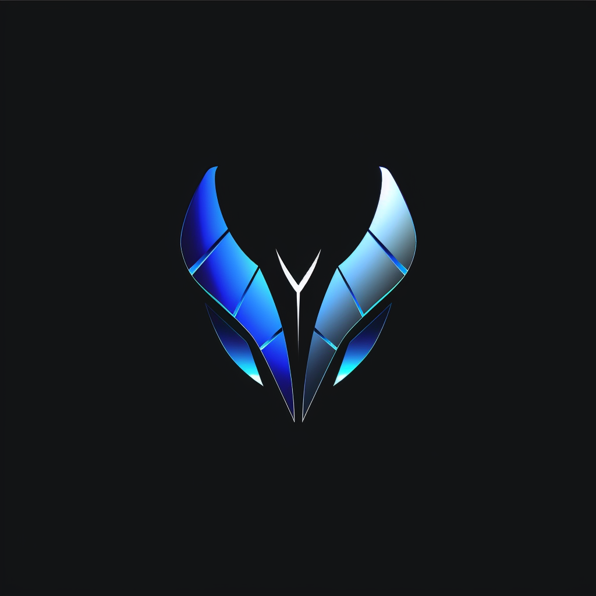

# Serendipity Web UI

> **⚠️ Note:** The Serendipity backend server has not been publicly released yet. This repository contains only the web UI frontend, which requires the backend to function. Please check back later for updates on the full release.

A standalone web interface for the Serendipity AI agent platform. This application provides a modern, responsive UI for managing AI agents, conversations, workflows, and system configurations.



## Features

- **Agent Management** - Select, configure, and customize AI agents
- **Conversations** - Real-time chat with AI agents via WebSocket streaming
- **Workflows** - Create and execute automated workflows
- **Voice Support** - Voice recording, transcription, and TTS playback
- **File Handling** - Upload and stage files for conversation context
- **LLM Configuration** - Configure multiple LLM providers (OpenAI, Anthropic, Groq, Ollama, vLLM, etc.)
- **MCP Servers** - Manage Model Context Protocol server connections
- **Toolsets** - Create collections of tools from MCP servers
- **Dark/Light Mode** - Toggle between themes
- **Bitcoin Authentication** - Secure API requests with Bitcoin message signing

## Tech Stack

- **Backend**: FastAPI (Python)
- **Frontend**: Vanilla JavaScript (ES Modules), TailwindCSS
- **Templating**: Jinja2
- **Authentication**: Bitcoin WIF key signing
- **Real-time**: WebSocket for streaming responses

## Prerequisites

- Python 3.12+ (for local development)
- Docker (for containerized deployment)
- A running Serendipity backend server

## Quick Start

### Using Docker (Recommended)

```bash
# Build the image
docker build -t serendipity-webui .

# Run the container
docker run -p 8080:8080 serendipity-webui
```

Access the application at `http://localhost:8080`

### Local Development

```bash
# Create virtual environment
python -m venv venv
source venv/bin/activate  # On Windows: venv\Scripts\activate

# Install dependencies
pip install -r requirements.txt

# Run the development server
uvicorn app.main:app --reload --host 0.0.0.0 --port 8080
```

## Configuration

On first launch, you'll be prompted to configure:

1. **Server Connection**
   - Server Address (default: `localhost`)
   - Server Port (default: `42069`)
   - WebSocket Port (default: `8765`)

2. **WIF Key**
   - Enter an existing WIF key or generate a new one
   - Optionally encrypt with a password for secure storage

All settings are stored in your browser's localStorage.

## Project Structure

```
serendipity-webui/
├── app/
│   ├── __init__.py
│   ├── main.py              # FastAPI application & routes
│   └── templates/           # Jinja2 HTML templates
│       ├── base.html        # Base template with sidebar
│       ├── agents.html      # Agent selection page
│       ├── agent_home.html  # Agent dashboard
│       ├── conversation.html # Chat interface
│       ├── conversations.html # Conversation list
│       ├── edit_agent.html  # Agent configuration
│       ├── settings.html    # App settings
│       ├── llms.html        # LLM configuration
│       ├── mcps.html        # MCP server config
│       ├── toolsets.html    # Toolset management
│       └── workflows.html   # Workflow editor
├── static/
│   ├── css/
│   │   ├── style.css        # Custom styles
│   │   ├── tailwind.css     # TailwindCSS source
│   │   └── tailwind.output.css # Compiled CSS
│   ├── images/
│   │   └── SERENDIPITY_icon.png
│   └── js/
│       ├── api.js           # API client
│       ├── bitcoin.js       # Bitcoin signing utilities
│       └── vendor/          # Third-party libraries
├── Dockerfile               # Multi-stage Docker build
├── entrypoint.sh           # Container entrypoint
├── requirements.txt        # Python dependencies
├── tailwind.config.js      # TailwindCSS configuration
└── build-css.sh            # CSS build script
```

## Pages

| Route | Description |
|-------|-------------|
| `/` | Agent selection |
| `/agent/{name}` | Agent dashboard |
| `/agent/{name}/conversations` | Conversation list |
| `/agent/{name}/conversation` | Chat interface |
| `/agent/{name}/edit` | Edit agent settings |
| `/agent/{name}/workflows` | Workflow editor |
| `/settings` | Application settings |
| `/llms` | LLM configurations |
| `/mcps` | MCP server configurations |
| `/toolsets` | Toolset management |

## API Integration

The web UI connects to a Serendipity backend server. All POST requests are authenticated using Bitcoin message signing:

```javascript
// Request format for authenticated endpoints
{
  "message": "/sha256/{hash}",
  "signature": "<bitcoin_signature>",
  "address": "<bitcoin_address>",
  "data": { /* request payload */ }
}
```

## Development

### Rebuilding CSS

If you modify TailwindCSS classes:

```bash
./build-css.sh
```

### Adding New Pages

1. Create a new template in `app/templates/`
2. Add a route in `app/main.py`
3. Extend `base.html` for consistent navigation

## Docker Details

The Dockerfile uses a multi-stage build for minimal image size:

- **Stage 1 (builder)**: Installs Python dependencies into a virtual environment
- **Stage 2 (runtime)**: Copies only the venv and application code

The container runs as a non-root user for security.

## License

This project is licensed under the MIT License - see the [LICENSE](LICENSE) file for details.
